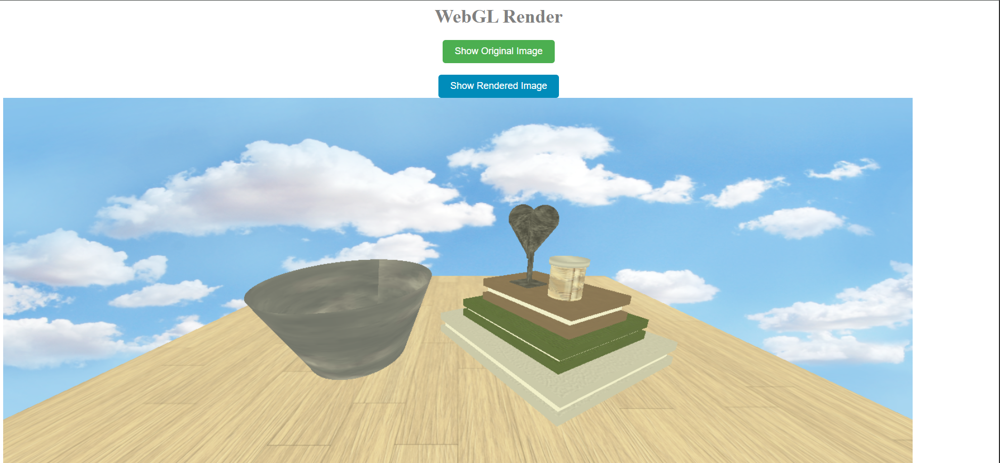

# WebGL Render
*A render of a stock image using WebGL and Vite*

**Tech Stack**
- JavaScript
- HTML
- CSS
- Vite

## Features
*The site when started allows the user to see both the original stock image and the render by clicking each respective button*

### Instructions
1. Clone repo and go into the folder
    - `git clone https://github.com/ctimko773/WebGL_Render`
    - `cd WebGL_Render`
2. Initalize npm and install vite and threeJS 
    - `npm init -y`
    - `npm install --save-dev vite`
    - `npm install --save three`
3. Run the server
    - `npx vite`
4. Open brower and navigate to local host
    - `http://localhost:5173`